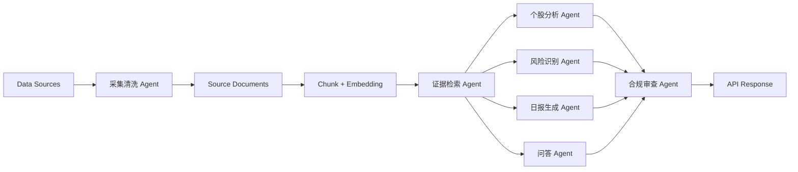

# AI Agent 架构

## 1. 总体架构

系统采用 RAG 架构。所有 AI 输出先检索证据，再生成分析，最后通过合规审查。生成结果必须区分事实信息、模型分析、投资建议、风险提示和证据链。

## 2. Agent 列表

### 2.1 采集清洗 Agent

- 输入：合法公开 API、授权数据源、用户手动导入文件。
- 输出：`source_documents` 和 `document_security_links`。
- 职责：
  - 标准化标题、正文、发布时间、来源 URL。
  - 计算 `raw_hash` 去重。
  - 识别相关股票和行业。
  - 标记数据源授权状态。

### 2.2 证据检索 Agent

- 输入：用户问题、股票、报告日期、风险扫描任务。
- 输出：相关 `document_chunks`、来源文档和证据摘录。
- 职责：
  - 结合关键词检索和向量检索。
  - 优先返回高可信度、近时效、与股票强相关的证据。
  - 证据不足时明确返回不足。

### 2.3 个股分析 Agent

- 输入：股票 ID、时间范围、证据集合。
- 输出：个股研究卡。
- 分析维度：
  - 基本面
  - 技术面
  - 资金面
  - 情绪面
  - 风险面
- 约束：
  - 不得凭空补充事实。
  - 建议必须引用证据。

### 2.4 风险识别 Agent

- 输入：自选股相关文档、行情异常、公告事件。
- 输出：风险提醒。
- 风险类型：
  - 业绩下滑
  - 监管处罚
  - 重大诉讼
  - 减持
  - 质押
  - 舆情异常
  - 股价异动
  - 财务异常
  - 政策不利

### 2.5 日报生成 Agent

- 输入：市场信息、政策、行业动态、自选股事件、风险提醒。
- 输出：早报、收盘复盘、夜间深度总结。
- 约束：
  - 每个关键结论必须附证据。
  - 建议只能使用允许的枚举标签。

### 2.6 问答 Agent

- 输入：用户自然语言问题和检索范围。
- 输出：结构化回答。
- 输出结构：
  - facts
  - analysis
  - suggestions
  - risks
  - evidence
  - disclaimer

### 2.7 合规审查 Agent

- 输入：所有 AI 草稿。
- 输出：通过、拒绝或修正后的版本。
- 审查规则：
  - 不得出现下单、撤单、自动交易、保证收益、确定性承诺。
  - 建议标签必须在允许枚举内。
  - 建议必须有证据。
  - 免责声明必须存在。

## 3. RAG 流程

1. 收集用户意图或生成任务。
2. 构造检索 query。
3. 从 `document_chunks` 中检索证据。
4. 聚合来源元数据。
5. 生成结构化草稿。
6. 合规审查。
7. 持久化输出和证据关联。
8. API 返回。

## 4. 提示词原则

- 明确区分事实、分析、建议和风险。
- 明确要求引用证据。
- 明确禁止交易指令和确定性承诺。
- 当证据不足时输出"信息不足，无法形成建议。"
- 使用中文输出。

## 5. 供应商抽象

后端应定义 provider-neutral 接口：

- `LLMClient.generate_structured(prompt, schema)`
- `EmbeddingClient.embed(texts)`
- `Reranker.rank(query, documents)`

具体模型供应商可替换，不写入业务逻辑。
