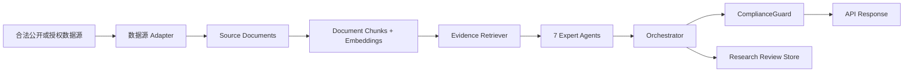

# AI Agent 架构

更新时间：2026-07-03

## 1. 总体定位

Gushen 使用 RAG + 多 Agent + Orchestrator + ComplianceGuard 架构。Agent 的职责是研究辅助，不是交易决策。每个专家 Agent 只能输出结构化 `ExpertSignal`，不能直接输出买卖结论、仓位建议、目标价或确定性承诺。

当前 Phase 1 是 Mock 闭环：后端同步或近同步运行 7 个 Mock Agent，并由 Mock Orchestrator 汇总为研究卡。该阶段不接真实数据源、不调用真实 AI 模型、不做真实 RAG 检索、不写入 pgvector。



## 2. 7 个专家 Agent

| Agent | 中文名称 | 核心任务 | 主要数据 | 默认策略 |
|---|---|---|---|---|
| `FinancialAgent` | 财务专家 | 分析营收、利润、现金流、负债、ROE、毛利率、业绩变化 | 财报、公告、财务指标 | 规则 + 轻量模型 |
| `TechnicalAgent` | 技术指标专家 | 分析趋势、均线、成交量、波动率、支撑压力 | 行情、K 线、成交量 | Python 计算优先 |
| `FundFlowAgent` | 资金流专家 | 分析主力资金、北向资金、成交活跃度、量能变化 | 资金流、成交数据 | Python 计算优先 |
| `MacroAgent` | 宏观专家 | 分析宏观政策、利率、流动性、监管环境 | 政策、宏观新闻、官方信息 | 长文本理解模型 |
| `IndustryAgent` | 行业专家 | 分析行业景气度、产业链位置、行业政策、竞争格局 | 行业数据、研报摘要、政策 | 轻量或中等模型 |
| `SentimentAgent` | 舆情专家 | 分析新闻情绪、市场关注度、社媒热度、负面信息 | 新闻、舆情、互动平台 | 文本分类/总结模型 |
| `RiskAgent` | 风险专家 | 检测财务、监管、退市、诉讼、违约、暴雷等重大风险 | 公告、监管、财报、新闻 | 强推理模型 + 规则 |

## 3. Agent 输出原则

禁止 Agent 输出：

- 建议买入、建议卖出、强烈买入、清仓、加仓、满仓、梭哈。
- 目标价、明确买入点位、明确卖出点位。
- 具体仓位比例。
- 保证上涨、保证收益、无风险、稳赚。

允许 Agent 输出：

- `bullish`、`neutral`、`bearish` 方向。
- 置信度、权重、分析周期、数据更新时间。
- 核心证据、反方证据、风险标记、缺失信息、判断假设。
- 结论摘要，但必须是研究辅助表达。

## 4. 标准 Schema

后端使用 Pydantic 定义统一结构。字段命名以英文为主，展示层可映射为中文。

```python
SignalDirection = Literal["bullish", "neutral", "bearish"]
TimeHorizon = Literal["short", "mid", "long"]
EvidenceGrade = Literal["S", "A", "B", "C", "D"]
AgentStatus = Literal["pending", "running", "completed", "failed", "partial"]

class EvidenceItem(BaseModel):
    evidence_id: str
    title: str
    summary: str
    source_name: str
    source_type: str
    source_grade: EvidenceGrade
    published_at: datetime | None = None
    url: str | None = None
    quote: str | None = None
    relevance_score: float = Field(..., ge=0, le=1)
    freshness_score: float = Field(..., ge=0, le=1)

class ExpertSignal(BaseModel):
    task_id: str
    stock_code: str
    stock_name: str | None = None
    agent_name: str
    agent_status: AgentStatus
    signal_direction: SignalDirection
    confidence: float = Field(..., ge=0, le=1)
    weight: float = Field(..., ge=0, le=1)
    time_horizon: TimeHorizon
    core_evidence: list[EvidenceItem] = Field(default_factory=list, max_items=3)
    negative_evidence: list[EvidenceItem] = Field(default_factory=list, max_items=3)
    risk_flags: list[str] = Field(default_factory=list)
    missing_info: list[str] = Field(default_factory=list)
    assumptions: list[str] = Field(default_factory=list)
    data_timestamp: datetime | None = None
    generated_at: datetime
    expires_at: datetime | None = None
    conclusion_summary: str
```

```python
ResearchGrade = Literal[
    "A_focus_tracking",
    "B_observe",
    "C_insufficient_info",
    "D_risk_elevated",
    "E_stop_tracking",
]

class DivergenceItem(BaseModel):
    topic: str
    bullish_agents: list[str] = Field(default_factory=list)
    bearish_agents: list[str] = Field(default_factory=list)
    explanation: str

class OrchestratorResult(BaseModel):
    task_id: str
    stock_code: str
    stock_name: str | None = None
    research_grade: ResearchGrade
    primary_time_horizon: TimeHorizon
    overall_direction: SignalDirection
    confidence: float = Field(..., ge=0, le=1)
    convergence_score: float = Field(..., ge=0, le=1)
    divergence_score: float = Field(..., ge=0, le=1)
    key_supporting_points: list[str] = Field(default_factory=list, max_items=5)
    key_risk_points: list[str] = Field(default_factory=list, max_items=5)
    key_divergences: list[DivergenceItem] = Field(default_factory=list)
    evidence_summary: list[EvidenceItem] = Field(default_factory=list, max_items=8)
    missing_info: list[str] = Field(default_factory=list)
    invalidation_conditions: list[str] = Field(default_factory=list)
    next_observation_points: list[str] = Field(default_factory=list)
    compliance_disclaimer: str
    generated_at: datetime
```

## 5. 证据等级与 RAG

| 等级 | 来源类型 | 使用规则 |
|---|---|---|
| S | 交易所公告、上市公司公告、定期报告、监管文件 | 可作为主要结论依据 |
| A | 官方政策、权威财经媒体、行业协会数据 | 可作为主要结论依据 |
| B | 券商研报摘要、机构观点、行业数据库 | 可作为辅助结论依据 |
| C | 普通财经新闻、互动平台、社交舆情 | 只能作为情绪或事件参考 |
| D | 论坛传闻、短视频观点、未经验证消息 | 不得作为研究结论依据 |

RAG 采用级联式流程：

```text
原始数据源
  -> Document / Chunk 入库
  -> Agent 级检索
  -> 每个 Agent 最多提炼 3 条核心证据 + 3 条反方证据
  -> Orchestrator 只读取结构化 Signal 和精选证据
  -> 前端默认展示精简结论，用户可展开原始证据链
```

主要结论只能基于 S/A/B 级证据。若只有 C/D 级证据，系统必须输出信息不足，不形成稳定研究判断。

## 6. Orchestrator

Orchestrator 不是交易决策器。它的角色是：

- 信号合成器。
- 矛盾显性化工具。
- 风险校验器。
- 证据整合器。
- 合规表达控制器。

三层仲裁流程：

1. 数据有效性检查：数据是否过期、关键证据是否缺失、证据等级是否足够、重大风险是否覆盖。
2. 多 Agent 冲突处理：标记财务与技术冲突、行业与公司财务冲突、舆情与风险冲突、资金与基本面错配等。
3. 合规输出控制：禁止买卖指令、仓位建议、目标价、保证收益；信息不足时返回不足。

研究分级：

| 等级 | 名称 | 含义 |
|---|---|---|
| A | 重点跟踪 | 多数高可信证据支持，风险可控，但不构成买入建议 |
| B | 可以继续观察 | 存在一定支持信号，但仍需等待验证 |
| C | 信息不足 | 证据不足、数据缺失或分歧过高，暂不形成判断 |
| D | 风险升高 | 存在明显风险，需要谨慎观察 |
| E | 不建议继续跟踪 | 风险较高、证据恶化或研究价值较低 |

## 7. RiskAgent 一票降级

RiskAgent 具备一票降级权。触发条件：

- RiskAgent 输出 `bearish`。
- 置信度大于等于 `0.85`。
- 风险类型属于重大财务、监管、退市、诉讼、立案调查、重大违约、业绩暴雷、大股东爆仓等。

触发结果：

- Orchestrator 必须将最终结论降级。
- 最终卡片顶部显示风险提醒。
- 即便其他 Agent 偏多，也不得输出 A 级“重点跟踪”。
- 输出强调风险和观察条件，而不是强行给出方向。

## 8. ComplianceGuard

ComplianceGuard 在 Orchestrator 输出后进行合规审查。

必须拦截：

- 建议买入、建议卖出、强烈买入。
- 满仓、梭哈、具体仓位比例。
- 目标价、明确买卖点位。
- 保证收益、一定上涨、无风险、稳赚。
- 无证据建议。
- 缺少免责声明的建议、报告、研究卡或问答结果。

替代表达：

| 禁止表达 | 替代表达 |
|---|---|
| 建议买入 | 可列入重点跟踪 |
| 建议卖出 | 风险升高，需谨慎观察 |
| 持有 | 可以继续观察 |
| 仓位 30% | 不提供仓位建议 |
| 目标价 | 后续观察区间由用户自行判断 |
| 一定上涨 | 存在不确定性，需结合后续信息验证 |

## 9. ModelRouter

模型供应商不能写死到业务逻辑中。后端通过 provider-neutral 接口调用模型：

- `LLMClient.generate_structured(prompt, schema)`
- `EmbeddingClient.embed(texts)`
- `Reranker.rank(query, documents)`

推荐分层：

| 层级 | 任务 | 策略 |
|---|---|---|
| 规则计算层 | 技术指标、资金指标、涨跌幅、成交量 | 不调用 LLM，使用 Python |
| 信息抽取层 | 财务指标、公告摘要、行业摘要 | 使用低成本模型 |
| 长文本理解层 | 宏观政策、舆情情感、新闻聚合 | 使用长上下文模型 |
| 强推理层 | Orchestrator、RiskAgent、ComplianceGuard | 使用强推理模型 |

## 10. 信息不足规则

满足任一条件时，不得强行输出稳定研究判断：

- 关键数据缺失。
- 只有 C/D 级证据。
- 7 个 Agent 中超过 3 个失败。
- RiskAgent 未运行成功。
- 数据明显过期。
- 多空分歧极高且无高可信证据支撑。

标准输出：

```text
信息不足，无法形成建议。
```

若上下文是研究分级说明，可进一步展示已获得事实、主要风险和缺失信息，但不能生成确定性建议。
