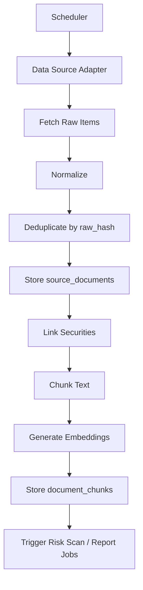

# 数据采集流程

## 1. 数据源原则

- 优先使用合法公开 API 或授权数据源。
- 支持用户手动导入文件或粘贴文本。
- 不绕过付费墙，不抓取受限系统，不伪造来源。
- 每条数据必须记录来源名称、URL、发布时间、采集时间和授权状态。

## 2. 数据类型

- 指数和板块行情
- 上市公司公告
- 财经新闻
- 政策变化
- 行业动态
- 财报数据
- 研报摘要
- 用户手动录入信息

## 3. 采集流程



## 4. 调度

MVP 使用 APScheduler：

- 早间采集：交易日前 7:30。
- 盘中轻量更新：每 30 分钟。
- 收盘采集：交易日 15:30。
- 夜间深度采集：交易日 21:00。
- 手动采集：用户从数据源状态页触发。

后续当任务量上升时切换 Celery：

- `collector.queue`
- `embedding.queue`
- `analysis.queue`
- `report.queue`

## 5. 适配器接口

每个数据源实现统一接口：

```python
class DataSourceAdapter:
    name: str
    authorization: str

    async def fetch(self, since: datetime | None) -> list[RawItem]:
        ...

    def normalize(self, item: RawItem) -> SourceDocumentCreate:
        ...
```

## 6. 去重策略

- 对来源 URL、标题、发布时间、正文摘要生成 `raw_hash`。
- 相同 `raw_hash` 跳过。
- 同一事件多来源保留多条文档，但用 `metadata.event_key` 关联。

## 7. 结构化与向量化

- 清洗 HTML、空白字符和重复声明。
- 长文按 800 到 1200 中文字符分块。
- chunk 保存 `document_id`、`chunk_index`、正文和 metadata。
- embedding 写入 pgvector。

## 8. 失败处理

- 每次采集写入 `collection_tasks`。
- 失败记录错误信息和来源。
- 网络失败可重试 3 次。
- 授权失败不自动重试，标记数据源需要人工处理。

## 9. 质量控制

- 低可信度来源默认不直接生成建议，只作为辅助信息。
- 关键建议优先引用公告、财报、监管、政策原文。
- 新闻和研报摘要必须标记为二级证据。
